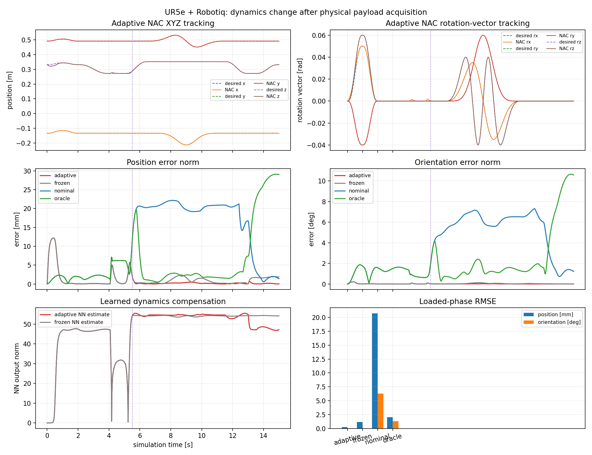
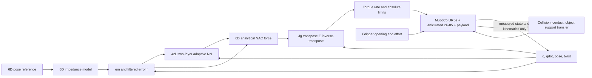

# ROS 2 Neuro-Adaptive Control

Six-DoF model-free neuro-adaptive impedance tracking through unknown payload
acquisition, demonstrated with full UR5e + Robotiq 2F-85 MuJoCo dynamics.

[](https://docs.ros.org/en/humble/)
[](https://releases.ubuntu.com/22.04/)
[](https://github.com/ZheminHuang/ros2_neuro_adaptive_control/actions/workflows/ci.yml)
[](LICENSE)
[](CHANGELOG.md)


## Key results

The physical object exists from the first MuJoCo step. Its mass, inertia,
collision, contact, and transfer from table support to the closed gripper all
participate in the dynamics; the NAC never receives payload mass, COM,
inertia, contact parameters, `qM`, or `qfrc_bias`.

Across three held-out 0.50–1.00 kg payloads with different COM and inertia,
both controllers completed the grasp, 80 mm lift, one 40 mm-radius Cartesian
circle, replacement, and release safely:

| Loaded-phase median | Adaptive NAC | Frozen at pickup | Improvement |
|---|---:|---:|---:|
| Position RMSE | 0.239 mm | 1.143 mm | 79.1% lower |
| Rotation-vector RMSE | 0.236 mrad | 1.057 mrad | 77.7% lower |
| Completion | 3 / 3 | 3 / 3 | no added failures |

For the offset 0.75 kg showcase, the nominal model-based controller's loaded
position RMSE was 12.38× its unloaded value and its orientation RMSE was 4.92×
its unloaded value. The payload-aware oracle is included as an upper reference,
so the comparison does not imply that every model-based controller must ignore
payload changes.



These are deterministic results for the bundled MuJoCo model, not real-robot,
hard-real-time, or universal-superiority claims. Here *model-free* means the
NAC does not require known robot or payload `M/C/G` dynamics; measured joint
state, pose/twist, forward kinematics, and Jacobians are still required.

## Quick Start

Requirements: Ubuntu 22.04, ROS 2 Humble, Python 3.10+, NumPy 1.24.4, and the
official MuJoCo 3.9.0 Python binding.

```bash
source /opt/ros/humble/setup.bash
python3 -m pip install --user "numpy==1.24.4" "mujoco==3.9.0"

cd your_ros2_workspace
rosdep install --from-paths src --ignore-src -r -y
colcon build --packages-select neuro_adaptive_control
source install/setup.bash

ros2 launch neuro_adaptive_control payload_benchmark.launch.py
```

The launch opens the native MuJoCo viewer and runs the adaptive controller at
a fixed 500 Hz simulation target. For headless, faster-than-real-time execution:

```bash
ros2 launch neuro_adaptive_control payload_benchmark.launch.py \
  viewer:=false realtime:=false
```

Select a comparison controller with
`controller:=frozen_at_payload`, `controller:=nominal_model_based`, or
`controller:=oracle_model_based`. Reproduce every held-out trial and all
committed evidence artifacts with:

```bash
MUJOCO_GL=egl python3 examples/run_payload_benchmark.py
```

## Architecture



The running torque path is the power-consistent 6D NAC mapping only; bounded
joint damping is reserved for stopping or fault handling. The earlier 3D RBF
API and demos remain available for compatibility.

Apache-2.0 project code; vendored robot assets retain their documented BSD
licenses. See [LICENSE](LICENSE), [CITATION.cff](CITATION.cff),
[CONTRIBUTING.md](CONTRIBUTING.md), and [THIRD_PARTY_NOTICES.md](THIRD_PARTY_NOTICES.md).
