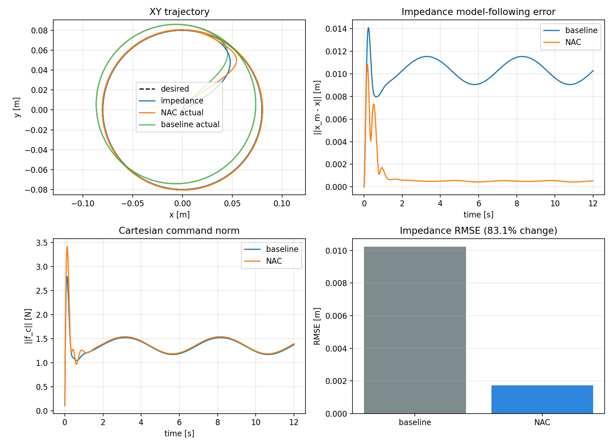
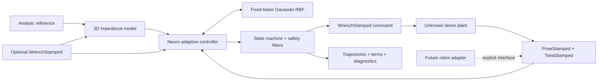

# ROS 2 Neuro-Adaptive Control

Model-free 3D Cartesian neuro-adaptive impedance trajectory tracking for ROS 2 Humble, with a pure NumPy controller core and a deterministic unknown-dynamics demo.

[](https://docs.ros.org/en/humble/)
[](LICENSE)
[](CHANGELOG.md)



The controller drives an unknown translational Cartesian plant toward a prescribed impedance response. A fixed Gaussian RBF network learns a lumped dynamics term online, while feedback, a robust term, command limits, a watchdog, finite-value guards, and a latched lifecycle supervisor bound the software behavior. v0.1.0 is simulation-only: it does not include a robot driver or a validated orientation controller.

## Quick start

Requirements: Ubuntu 22.04, ROS 2 Humble, Python 3.10+, NumPy, and `colcon`.
Matplotlib is used only when the standalone example writes a plot; `rosdep`
installs the matching Ubuntu package.

From a ROS 2 workspace containing this repository under `src/`:

```bash
source /opt/ros/humble/setup.bash
rosdep install --from-paths src --ignore-src -r -y
colcon build --packages-select neuro_adaptive_control
source install/setup.bash
ros2 launch neuro_adaptive_control demo.launch.py
```

The launch starts the controller and deterministic plant, follows a circle for 12 simulated seconds, publishes all trajectories and controller terms, prints RMSE/max-error/command metrics, sends a final zero command, and exits. Save ROS-run metrics to a relative directory with:

```bash
ros2 launch neuro_adaptive_control demo.launch.py output_directory:=results/ros
```

Run an identical frozen-weight baseline by changing only adaptation:

```bash
ros2 launch neuro_adaptive_control demo.launch.py adaptation_enabled:=false
```

From the repository root, the ROS-independent paired comparison also writes
CSV, JSON, and a plot:

```bash
python3 examples/run_deterministic_demo.py --output-directory results/core
```

## Reproducible v0.1.0 result

The committed result uses the same unknown coupled plant, initial state, seed, reference, fixed step, and disturbance in both runs. Only RBF adaptation changes.

| Circle, 12 s, 500 Hz fixed step | Frozen weights | NAC | Difference |
|---|---:|---:|---:|
| Impedance tracking RMSE | 0.0102201 m | 0.00172787 m | 83.09% lower |
| Desired tracking RMSE | 0.0158431 m | 0.0114870 m | 27.50% lower |
| Impedance maximum error | 0.0140923 m | 0.0108417 m | 23.07% lower |
| Command RMS norm | 1.36121 N | 1.39635 N | 2.58% higher |
| Command maximum norm | 2.79301 N | 3.41573 N | 22.30% higher |
| Saturated samples | 0 / 6000 | 0 / 6000 | unchanged |

See the [machine-readable metrics](docs/metrics/v0.1.0_demo_metrics.json) and [experiment notes](docs/demo_results.md). These numbers describe one deterministic bundled simulation; they are not a general performance claim, hardware result, or stability proof.

## Architecture



`neuro_adaptive_control/core/` imports only Python/NumPy. `nodes/` owns ROS messages and scheduling. `adapters/interfaces.py` reserves a state-provider/force-sink boundary without claiming any hardware implementation. More detail is in [docs/architecture.md](docs/architecture.md).

## Mathematical contract

For unknown translational dynamics

$$M_C(q)\ddot x+C_C(q,\dot q)\dot x+F_C(\dot q)+G_C(q)=f_c+K_hw_{ext},$$

the prescribed impedance response is

$$M_m\ddot x_m+D_m\dot x_m+K_mx_m=K_hw_{ext}+M_m\ddot x_d+D_m\dot x_d+K_mx_d.$$

v0.1.0 fixes the signs as

$$e_m=x_m-x,\qquad r=\dot e_m+\Lambda e_m,$$

and uses

$$\phi_i(z)=\exp\!\left(-\frac{\lVert\bar z-c_i\rVert^2}{2b_i^2}\right),\quad \hat G=\hat W^T\phi,$$

$$f_c^{raw}=\hat G+K_vr+(\lVert\hat W\rVert_F+b_r)K_rr-K_hw_{ext},$$

$$\dot{\hat W}=\gamma\left(\phi r^T-\kappa\lVert r\rVert\hat W\right).$$

The command is subsequently saturated. The model uses semi-implicit Euler; weights use explicit Euler plus Frobenius-norm projection. The complete regressor, dimensions, external-wrench `plant + / model + / command -` convention, source discrepancies, and proof boundary are normative in [docs/math_contract.md](docs/math_contract.md).

Here, **model-free** means the controller does not require known or evaluated robot `M/C/F/G` dynamics. It does not remove the need for state estimation, forward kinematics, a Jacobian, frame transforms, or a robot-specific command mapping.

## Reference trajectories

All references include analytic position, velocity, and acceleration.

```bash
ros2 launch neuro_adaptive_control demo.launch.py reference_type:=circle
ros2 launch neuro_adaptive_control demo.launch.py reference_type:=line
ros2 launch neuro_adaptive_control demo.launch.py reference_type:=figure8
ros2 launch neuro_adaptive_control demo.launch.py reference_type:=fixed_point
ros2 launch neuro_adaptive_control demo.launch.py reference_type:=figure8 external_wrench_enabled:=true
```

## ROS interface

All Cartesian vectors are expressed in the configured `frame_id`. Orientation fields are identity placeholders and torque fields are zero; only translation is controlled.

| Direction | Topic (default) | Type | Meaning |
|---|---|---|---|
| input | `demo/cartesian_pose` | `geometry_msgs/PoseStamped` | measured Cartesian position |
| input | `demo/cartesian_twist` | `geometry_msgs/TwistStamped` | measured Cartesian linear velocity |
| input | `demo/applied_external_wrench` | `geometry_msgs/WrenchStamped` | coherent applied external force sample |
| input | `demo/external_wrench_input` | `geometry_msgs/WrenchStamped` | optional future-stamped demo-plant wrench override |
| output | `nac/wrench_command` | `geometry_msgs/WrenchStamped` | saturated Cartesian force command |
| output | `nac/desired_pose`, `nac/desired_twist` | `PoseStamped`, `TwistStamped` | desired trajectory |
| output | `nac/impedance_pose`, `nac/impedance_twist` | `PoseStamped`, `TwistStamped` | impedance response |
| output | `nac/actual_pose` | `geometry_msgs/PoseStamped` | synchronized actual trajectory |
| output | `nac/nn_estimate` | `geometry_msgs/WrenchStamped` | RBF lumped-dynamics estimate |
| output | `nac/tracking_error` | `geometry_msgs/Vector3Stamped` | `x_m - x` |
| output | `diagnostics` | `diagnostic_msgs/DiagnosticArray` | state, timing, faults, saturation, and metrics |

Private `std_srvs/Trigger` services are `/nac_controller/start`, `/nac_controller/stop`, and `/nac_controller/reset`. Reset clears the impedance state, NN weights, timestamp caches, and fault/saturation/watchdog history before returning to `start`.

An external-wrench override must use the configured frame and the exact stamp
of a future plant step, and must arrive before that step's state bundle is
published. Otherwise the configured deterministic wrench (or zero when
disabled) is used. The applied sample is republished on
`demo/applied_external_wrench` so the plant, impedance model, and controller
use one coherent value.

“Optional” means the applied wrench may be zero; the controller still requires
a same-stamp wrench message for every pose/twist bundle so that signs cannot
silently diverge. The bundled plant publishes an explicit zero sample when the
disturbance is disabled. A future adapter must do the same when no external
wrench is available.

### Launch arguments

| Argument | Default | Meaning |
|---|---:|---|
| `reference_type` | `circle` | `circle`, `line`, `figure8`, or `fixed_point` |
| `adaptation_enabled` | `true` | enable RBF output-weight adaptation |
| `external_wrench_enabled` | `false` | enable deterministic physical disturbance |
| `duration_sec` | `12.0` | fixed simulated duration |
| `control_rate_hz` | `500.0` | target fixed-step rate; not a real-time guarantee |
| `output_directory` | empty | optional relative directory for ROS metrics JSON |

### Parameters

`config/default.yaml` is the authoritative configuration. The public parameter groups are:

| Group | Important parameters (defaults) |
|---|---|
| timing/lifecycle | `control_rate_hz: 500`, `duration_sec: 12`, `auto_start: true`, `frame_id: world` |
| trajectory | `trajectory.type: circle`, `center: [0,0,0]`, `frequency: 0.20`, plus circle radius, line length/axis, and figure-eight width/height |
| impedance | diagonal `mass: [1,1,1]`, `damping: [12,12,12]`, `stiffness: [35,35,35]`, `external_gain: [1,1,1]` |
| NAC | `lambda_gain: [7,7,7]`, `feedback_gain: [18,18,20]`, `robust_gain: [0.04,0.04,0.04]`, `robust_bias: 1.5` |
| RBF | `num_basis: 31`, `width: 2.5`, `learning_rate: 5`, `leakage: 0.01`, `weight_limit: 80`, `seed: 7`, `adaptation_enabled: true` |
| safety | per-axis command limits `[40,40,40] N`, norm limit `55 N`, watchdog `0.10 s`, maximum algorithmic `dt: 0.01 s`, cache size `8` |
| telemetry | telemetry `100 Hz`, diagnostics `20 Hz`, remappable names under `topics.*` |
| demo plant | `plant_substeps: 4`, `external_gain: [1,1,1]`, optional wrench amplitude/frequency and `topics.external_wrench_input`, command watchdog `0.25 s` |

Changing the RBF regressor dimension requires an adapter-specific center/scaling design and matching tests; it is not a runtime tuning shortcut.
For a coherent wrench contract, the demo plant's `external_gain` and the
controller's `impedance.external_gain` must be changed together; the bundled
configuration sets both to the identity diagonal.

## Safety and lifecycle

The controller implements `start -> running -> stopping -> stopped`, with `running -> fault`. A stop publishes zero before exit. NaN/Inf, invalid dimensions or time steps, time reversal, stale state, and internal numerical errors latch `fault` and return zero. Commands are first clipped per axis and then by Euclidean norm. Fault recovery requires explicit reset.

These are software guards, not a certified safety system. Before any hardware work, add independent emergency stop, collision/workspace/velocity/force limits, validated frames and signs, singularity handling, robot controller integration, network-loss behavior, and staged low-energy tests. Never connect the demo command directly to a robot.

## Timing and known limitations

The deterministic algorithm targets a 2 ms step. A 5,000-sample pure-core regression on the release host measured 0.1066 ms median, 0.1131 ms p95, and 0.1267 ms p99 per adaptive step. The final complete 12 s ROS launch processed all 6,000 fixed steps at 499.06 Hz observed wall-clock throughput, reported 4 missed wall deadlines and 0 stamp mismatches, then exited cleanly. See [docs/performance.md](docs/performance.md) for scope and commands. These are soft measurements on one non-real-time system: Python, `rclpy`, DDS, and the host OS provide **no hard real-time guarantee**.

Current limitations:

- simulation only; no UR5e `force_mode` or other hardware adapter;
- 3D translation only; no validated 6D pose/orientation control;
- no ADP impedance optimization or human system identification;
- no sampled-data stability proof for the projected, saturated RBF controller;
- no automatic frame transform, wrench bias/filtering, collision avoidance, or singularity handling;
- deterministic demo metrics do not establish robustness outside the tested envelope.

## Test and audit

```bash
source /opt/ros/humble/setup.bash
colcon build --packages-select neuro_adaptive_control
source install/setup.bash
colcon test --packages-select neuro_adaptive_control
colcon test-result --verbose
```

Tests cover RBF values/shapes/adaptation/projection, impedance integration and signs, controller terms and dimensions, deterministic reset, all lifecycle states, saturation, watchdogs, invalid parameters, NaN/Inf faults, zero-error behavior, all references, unknown-plant isolation, repeatable integration tracking, NAC-versus-baseline metrics, lint, licensing, and a soft 500 Hz core timing regression.

Provenance and license decisions are documented in [docs/source-map.md](docs/source-map.md) and the [v0.1.0 license audit](docs/license-audit.md). No manuscript, reference-controller source, robot calibration, network address, private log, participant data, video, or hardware asset is distributed.

## Roadmap

A sensible v0.2 sequence is: define a frame-explicit robot adapter contract; add kinematics/Jacobian and singularity tests against a simulator; validate wrench transforms and delays; add a C++/real-time-safe command boundary; and only then conduct staged hardware validation. A future 6D controller should introduce a mathematically reviewed orientation-error contract rather than extending 3D arrays informally.

## Citation, contributing, security, and license

If this software supports research, cite the metadata in [CITATION.cff](CITATION.cff). Contributions are welcome under [CONTRIBUTING.md](CONTRIBUTING.md); report vulnerabilities according to [SECURITY.md](SECURITY.md). The project is released under the [Apache License 2.0](LICENSE). See [CHANGELOG.md](CHANGELOG.md) for release contents.
