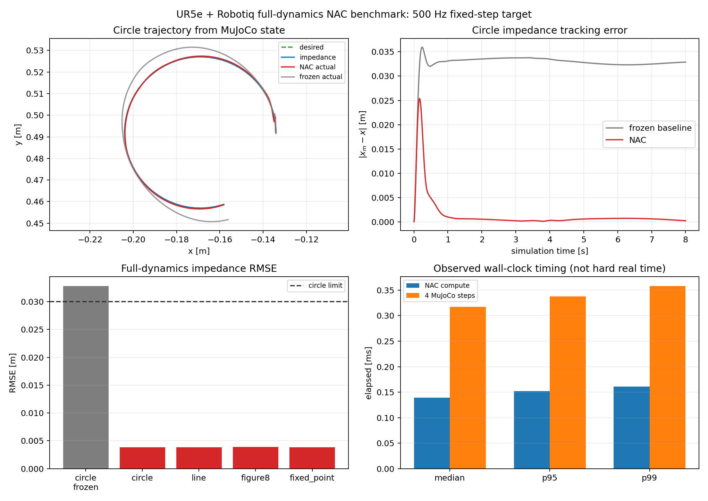
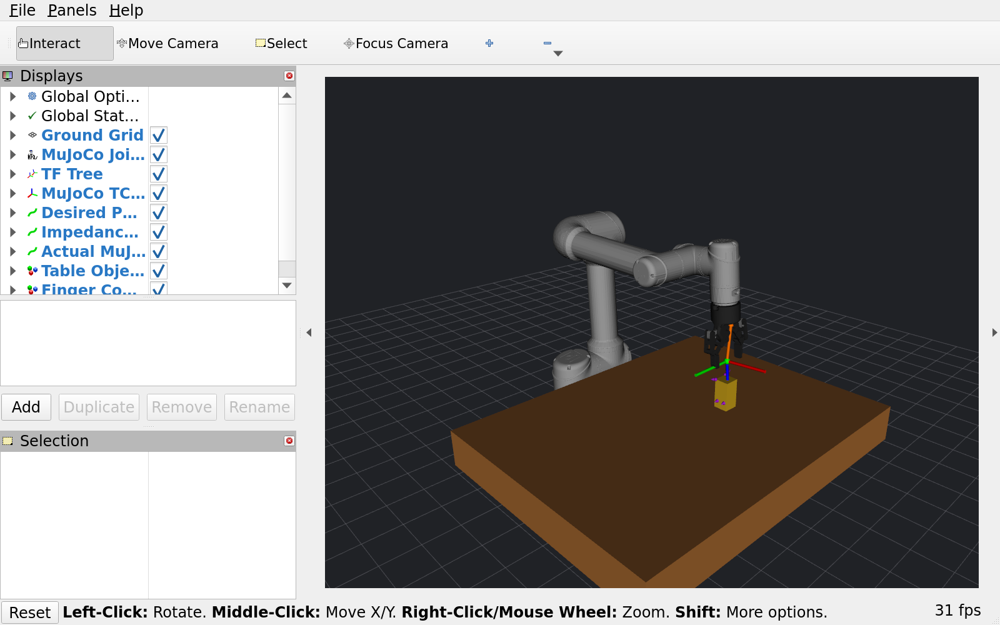
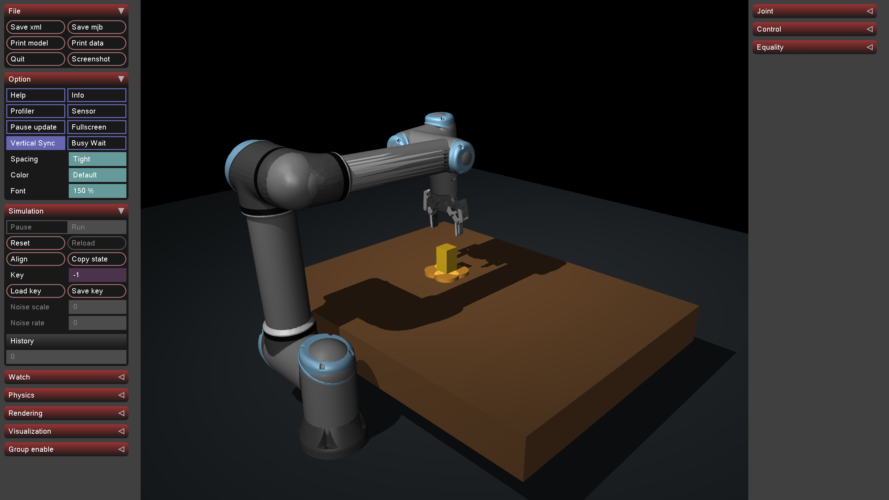
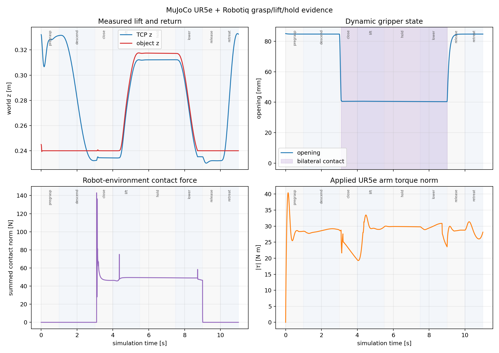
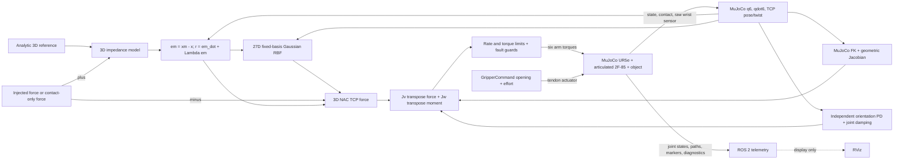

# ROS 2 Neuro-Adaptive Control

Model-free **3D Cartesian** neuro-adaptive impedance tracking for ROS 2
Humble, now with a v0.2.0 candidate full-dynamics MuJoCo simulation of a UR5e
and articulated Robotiq 2F-85. **MuJoCo computes all robot, gripper, actuator,
collision, and contact dynamics; RViz is display-only.**

[](https://docs.ros.org/en/humble/)
[](LICENSE)
[](CHANGELOG.md)
[](CHANGELOG.md)



The adaptive controller remains a translational controller: it returns a
three-component TCP force. A separate, non-adaptive orientation-hold PD term
and joint damping make the torque-controlled robot simulation well posed.
Nothing in this candidate claims a learned 6D controller, a hardware driver,
or validated real-robot behavior.

> **Release status:** v0.1.0 remains the latest published release. The code and
> artifacts described below are a v0.2.0 candidate and must not be tagged or
> published until the user completes visual acceptance of both RViz demos and
> the final build, test, license, privacy, and provenance audit passes.

## Quick start: MuJoCo + RViz

Requirements are Ubuntu 22.04, ROS 2 Humble, Python 3.10+, NumPy, `colcon`,
and the official MuJoCo Python binding pinned to 3.9.0. Install MuJoCo into the
same Python environment used by ROS:

```bash
source /opt/ros/humble/setup.bash
python3 -m pip install --user "numpy==1.24.4" "mujoco==3.9.0"
python3 -c "import mujoco, numpy; print(mujoco.__version__, numpy.__version__)"
```

From a ROS 2 workspace containing this repository under `src/`:

```bash
source /opt/ros/humble/setup.bash
rosdep install --from-paths src --ignore-src -r -y
colcon build --packages-select neuro_adaptive_control
source install/setup.bash
```

Launch the trajectory demo (circle, 12 simulated seconds):

```bash
ros2 launch neuro_adaptive_control ur5e_mujoco_rviz.launch.py
```

Launch the automated descend, grasp, lift, hold, lower, release, and retreat
demo (11 simulated seconds):

```bash
ros2 launch neuro_adaptive_control ur5e_mujoco_grasp_demo.launch.py
```

Both commands start one MuJoCo owner, `robot_state_publisher`, the
display-only bridge, the standard gripper action server, and RViz. The launch
graph shuts down after the finite simulation completes.



This is a capture from the running ROS launch, not an illustration. The robot
and articulated gripper come from MuJoCo `/joint_states`; the table, object,
TCP axes, forces, contacts, and paths are ROS visualization telemetry.

### Headless and viewer choices

Run headless, without either GUI:

```bash
ros2 launch neuro_adaptive_control ur5e_mujoco_rviz.launch.py start_rviz:=false
```

Use the native MuJoCo passive viewer instead of RViz:

```bash
ros2 launch neuro_adaptive_control ur5e_mujoco_rviz.launch.py \
  start_rviz:=false start_mujoco_viewer:=true
```

To inspect both views, leave `start_rviz` at its default and set only
`start_mujoco_viewer:=true`. The MuJoCo viewer reads the same model/data
owned by the simulation node; RViz receives published state and never advances
or modifies physics.



The passive viewer is intended for collision, contact, penetration, actuator,
and solver inspection. It adds substantial rendering load and is disabled for
loop-rate acceptance measurements.

### Frozen-weight baseline

The launch baseline preserves the same plant, initial state, reference, step,
and seed while disabling only RBF weight adaptation:

```bash
ros2 launch neuro_adaptive_control ur5e_mujoco_rviz.launch.py \
  adaptation_enabled:=false \
  metrics_path:=results/mujoco_circle_baseline.json
```

For the canonical paired benchmark, use the standalone generator documented
under [Reproducing the evidence](#reproducing-the-evidence); it verifies that
the adaptive and baseline scenario fields match.

### Robotiq `GripperCommand`

While the trajectory launch is running, command a 2 N close or full opening
from another sourced terminal:

```bash
ros2 action send_goal \
  /robotiq_gripper/gripper_command \
  control_msgs/action/GripperCommand \
  "{command: {position: 0.0, max_effort: 2.0}}" --feedback

ros2 action send_goal \
  /robotiq_gripper/gripper_command \
  control_msgs/action/GripperCommand \
  "{command: {position: 0.085, max_effort: 2.0}}" --feedback
```

Position is the requested opening in metres (`0.0` closed,
`0.085` fully open). A zero `max_effort` selects the configured 5 N ceiling;
negative effort is rejected. The action reports measured MuJoCo opening, effort,
`reached_goal`, and `stalled`. Only one goal may be active; a concurrent goal
is rejected so two commands cannot overwrite the same actuator. The action
does not animate a kinematic mock-up. Cancel is the explicit stop path; reset
is rejected while a goal is active so it cannot silently replace that goal.

## Reproducible v0.2.0-candidate evidence

The committed plots are generated from recorded MuJoCo state, not drawn
illustrations or RViz screenshots. Their JSON companions include the scenario,
versions, source/model hashes, deterministic history hashes, metrics, and
acceptance booleans. The canonical artifacts use the ROS Humble system Python
3.10.12, NumPy 1.24.4, and MuJoCo 3.9.0.

### Tracking and adaptation

The canonical comparison is an 8 s circle at a fixed 0.002 s controller period
with four 0.0005 s MuJoCo `implicitfast` substeps, seed 23, and no external
wrench. Only adaptation changes.

| Measured circle metric | Frozen weights | NAC | Difference |
|---|---:|---:|---:|
| Impedance tracking RMSE | 0.0328492 m | 0.00385451 m | 88.266% lower |
| Impedance maximum error | 0.0359412 m | 0.0253601 m | 29.44% lower |
| Maximum Cartesian command norm | 56.5299 N | 62.3284 N | 10.26% higher |
| Maximum absolute arm torque | 26.9360 N m | 29.6646 N m | 10.13% higher |
| Final RBF weight norm | 0 | 9.95066 | adaptation active |
| Joint torque/rate saturation | 0 / 0 samples | 0 / 0 samples | unchanged |

All four adaptive references stopped without fault:

| Reference | Impedance RMSE | Maximum error |
|---|---:|---:|
| circle | 0.00385451 m | 0.0253601 m |
| line | 0.00384195 m | 0.0254873 m |
| figure8 | 0.00387925 m | 0.0253290 m |
| fixed_point | 0.00383689 m | 0.0254866 m |

The synchronous benchmark completed the adaptive circle in 4.179873 s wall
time for 8.0 s simulated time (real-time factor 1.91393). Its NAC computation
median, p95, and p99 were 0.139414, 0.151849, and 0.161215 ms. This is one
host measurement from a non-real-time standalone runner, not a ROS scheduling
guarantee or a hard-real-time claim.

See the
[tracking JSON](docs/assets/mujoco_tracking_benchmark.json) and
[candidate result notes](docs/mujoco_demo_results.md).

### Dynamic grasp



| Measured 11 s grasp metric | Result |
|---|---:|
| Object lift height | 0.0776457 m |
| Hold duration | 2.000 s |
| Hold drop | 0.000396843 m |
| Bilateral-contact ratio during hold | 1.000 |
| Maximum gripper effort | 2.000 N |
| Maximum contact-force norm sum | 143.048 N |
| Maximum absolute arm torque | 30.0242 N m |
| Unexpected contacts / solver warnings / torque saturation | 0 / 0 / 0 |
| Final state | `stopped`, no fault |

The gripper linkage, tendon actuator, loop-closure constraints, collisions,
contact, object, and payload all participate in MuJoCo. See the
[grasp JSON](docs/assets/mujoco_grasp_benchmark.json) and
[candidate result notes](docs/mujoco_demo_results.md). These two deterministic
scenarios are evidence for the bundled model and parameters only; they are not
general performance or sim-to-real claims.

## Closed-loop architecture



There is exactly one mutable MuJoCo model/data owner. The controller does not
read mass matrices, bias forces, gravity compensation, contact parameters, or
ground-truth disturbances. RViz does not calculate dynamics, inverse
kinematics, contact, or commands.

## Control contract: 3D NAC, not learned 6D control

The robot regressor is

$$z=[q_6,\dot q_6,x_m,\dot x_m,\ddot x_m,e_m,\dot e_m]\in\mathbb R^{27},$$

and the translational controller returns

$$f_c=\operatorname{saturate}\left(
\hat G+K_vr+(\lVert\hat W\rVert_F+b_r)K_rr-K_hf_{ext}\right)
\in\mathbb R^3.$$

Only the RBF output weights adapt. A separate fixed-orientation task supplies

$$m_R=K_Re_R-D_R\omega,\qquad
\tau=J_v^Tf_c+J_\omega^Tm_R-D_q\dot q,$$

followed by torque-rate and absolute-torque limits. If either joint limit is
active, the runner restores the RBF weights from before that sample. The
orientation term is non-adaptive and exists to hold the TCP attitude; it does
not establish a 6D NAC result.

`external_wrench_mode` has three explicit meanings:

- `none`: the model, controller, and injected plant force all receive zero;
- `injected`: one deterministic TCP force enters the impedance model with
  `+`, the NAC command with `-`, and MuJoCo once with `+`;
- `virtual_ft`: the contact-only environment-on-robot force enters the
  model with `+` and command with `-`; it is not injected again because
  MuJoCo contact has already acted on the plant.

The raw wrist cut-wrench is diagnostics-only and differs from the contact-only
wrench shifted to the `gripper_pinch` TCP. The normative signs, frames,
discretization, saturation behavior, and proof boundary are in
[docs/math_contract.md](docs/math_contract.md) and
[docs/mujoco_dynamics_contract.md](docs/mujoco_dynamics_contract.md).

Here, **model-free** means the NAC and torque mapper do not require known or
evaluated robot `M/C/F/G` dynamics. Measured joint state, forward
kinematics, Jacobians, pose/twist, frame transforms, and an external-force
measurement remain necessary.

## ROS interface

Default topic names below assume no enclosing namespace.

| Direction | Topic | Type | Meaning |
|---|---|---|---|
| output | `/clock` | `rosgraph_msgs/Clock` | fixed simulation clock |
| output | `/joint_states` | `sensor_msgs/JointState` | six arm and eight gripper joint states from MuJoCo |
| output | `/mujoco/desired_pose`, `/mujoco/impedance_pose`, `/mujoco/actual_pose` | `geometry_msgs/PoseStamped` | desired, model, and measured TCP poses |
| output | `/mujoco/desired_path`, `/mujoco/impedance_path`, `/mujoco/actual_path` | `nav_msgs/Path` | decimated RViz traces |
| output | `/mujoco/nac_command` | `geometry_msgs/WrenchStamped` | 3D NAC force; torque fields are zero |
| output | `/mujoco/nn_estimate` | `geometry_msgs/WrenchStamped` | RBF lumped-force estimate |
| output | `/mujoco/tracking_error` | `geometry_msgs/Vector3Stamped` | `x_m - x` |
| output | `/mujoco/wrist_wrench_raw` | `geometry_msgs/WrenchStamped` | raw wrist-site cut-wrench |
| output | `/mujoco/external_contact_wrench` | `geometry_msgs/WrenchStamped` | contact-only environment-on-robot wrench at TCP |
| output | `/mujoco/wrist_wrench` | `geometry_msgs/WrenchStamped` | compatibility alias of contact-only wrench |
| output | `/mujoco/scene_markers`, `/mujoco/contact_markers` | `visualization_msgs/MarkerArray` | table/object/points/force arrows |
| output | `/diagnostics`, `/mujoco/contact_diagnostics` | `diagnostic_msgs/DiagnosticArray` | state, timing, contact, saturation, and signs |
| output | `/mujoco/gripper/state` | `std_msgs/Float64MultiArray` | measured opening, effort, target, contacts, result flags |
| output | `/mujoco/gripper/actuator_command` | `std_msgs/Float64` | current MuJoCo tendon-control value |
| internal input | `/mujoco/gripper/command` | `std_msgs/Float64MultiArray` | action-server-to-plant command bridge |

| Interface | Name | Type |
|---|---|---|
| action | `/robotiq_gripper/gripper_command` | `control_msgs/action/GripperCommand` |
| service | `/mujoco/reset` | `std_srvs/srv/Trigger` |
| service | `/mujoco/stop` | `std_srvs/srv/Trigger` |
| service | `/robotiq_gripper/reset` | `std_srvs/srv/Trigger` |

### Frames and RViz colors

- `world` is the fixed RViz frame, fixed UR5e base frame, controller frame,
  and frame for all published Cartesian vectors.
- `gripper_pinch` is the MuJoCo TCP/application point;
  `wrist_ft_site` is the distinct raw sensor site.
- `mujoco_tcp`, `desired_tcp`, and `impedance_tcp` are
  display-only TF children broadcast from pose telemetry.
- The URDF joint tree is animated only by MuJoCo `/joint_states`; RViz
  does not synthesize mimic motion.
- Desired is green, impedance is blue, and measured MuJoCo TCP is red. NAC
  force is orange; contact points, normals, and force are purple. The table is
  brown and the grasp object is gold.

## Launch arguments and parameters

### `ur5e_mujoco_rviz.launch.py`

| Argument | Default | Meaning |
|---|---:|---|
| `start_rviz` | `true` | start display-only RViz |
| `start_mujoco_viewer` | `false` | start MuJoCo passive viewer |
| `scenario` | `trajectory` | `trajectory` or the internal `grasp` schedule |
| `trajectory` | `circle` | `circle`, `line`, `figure8`, or `fixed_point` |
| `duration_sec` | `12.0` | finite simulated duration |
| `adaptation_enabled` | `true` | enable online RBF output-weight adaptation |
| `external_wrench_mode` | `none` | `none`, `injected`, or `virtual_ft` |
| `metrics_path` | empty | optional relative JSON output file |

`ur5e_mujoco_grasp_demo.launch.py` exposes `start_rviz`,
`start_mujoco_viewer`, and `metrics_path`; it fixes the grasp
scenario to 11.0 s with adaptation enabled and external mode `none`.

### `config/mujoco_ur5e_robotiq.yaml`

| Node/group | Parameter | Default |
|---|---|---:|
| plant | `model_path` | empty, use packaged composite MJCF |
| plant | `scenario` / `trajectory` | `trajectory` / `circle` |
| plant | `duration_sec` | `12.0` |
| plant | `adaptation_enabled` | `true` |
| plant | `external_wrench_mode` | `none` |
| plant | `seed` | `23` |
| plant | `frame_id` | `world` |
| plant | `visualization_rate_hz` | `20.0` |
| plant | `shutdown_when_complete` | `true` |
| plant | `start_mujoco_viewer` | `false` |
| plant | `metrics_path` | empty |
| gripper | `action_name` | `robotiq_gripper/gripper_command` |
| gripper | `goal_timeout_sec` | `8.0` |
| gripper | `maximum_opening_m` | `0.085` |
| gripper | `maximum_effort_n` | `5.0` |

The fixed controller period is 0.002 s and the fixed MuJoCo timestep is
0.0005 s with exactly four substeps. They are implementation contracts, not
runtime tuning parameters in this candidate.

## Robot-model scope and provenance

The composite plant includes all six UR5e joints and all eight articulated
Robotiq joints, link masses and inertias, the tendon actuator, loop-closure
constraints, collision geometries, contacts, table, and a dynamic free object.
Even when the fingers do not move, the gripper mass and inertia remain part of
the arm dynamics.

“Full dynamics” here means the complete articulated public model participates
in MuJoCo equations and contact. It does **not** mean a manufacturer-calibrated
digital twin. The public Menagerie descriptions are simplified; gripper motor
electrical dynamics, backlash, self-locking, identified friction, calibrated
soft-pad/contact parameters, and verified per-link manufacturer inertias are
not available. See
[model provenance](docs/ur5e_robotiq_model_provenance.md).

Project code is Apache-2.0. The pinned UR5e model/assets remain BSD-3-Clause,
the pinned Robotiq model/assets remain BSD-2-Clause, and MuJoCo 3.9.0 is an
Apache-2.0 runtime dependency. See [THIRD_PARTY_NOTICES.md](THIRD_PARTY_NOTICES.md),
[mujoco/SOURCE.yml](mujoco/SOURCE.yml), and [mujoco/SHA256SUMS](mujoco/SHA256SUMS).
No source from the older local ROS/UR5e repositories is copied into this
project.

## Safety and limitations

The simulation owner uses
`resetting -> start -> running -> stopping -> stopped`, with a latched
`fault` path. Guards cover non-finite values, sequence/stamp mismatch,
MuJoCo warnings, joint speed, workspace, orientation error, raw torque,
contact force, command torque/rate saturation, and deterministic reset.
The guards run both before and after each four-substep integration interval.
Fault is latched until explicit reset; a stop request cannot hide it. Fault and
normal completion replace NAC torque by bounded damping, hold measured gripper
opening, clear externally applied forces, and stop physics. The dynamic scene
is paused rather than stepped under an uncontrolled command.

These are testable simulation guards, not a certified safety system:

- **Do not connect these torques or Cartesian forces directly to a real
  robot.** No UR driver, `ros2_control` hardware adapter, emergency stop,
  protective-stop integration, or network-loss policy is included.
- Control adaptation is 3D translation only. Orientation hold is fixed PD,
  not adaptive 6D impedance control.
- No singularity-robust inverse, collision avoidance planner, automatic frame
  transform, wrist tare/payload compensation, or real sensor filtering exists.
- Tests and deterministic metrics do not prove sampled-data stability,
  continuous-time UUB for this modified implementation, hard real-time
  scheduling, hardware safety, or sim-to-real transfer.
- Contact results depend on the bundled solver, collision, friction, and
  compliance approximations.

## Reproducing the evidence

From the repository root after installing MuJoCo 3.9.0:

```bash
python3 examples/run_mujoco_benchmark.py \
  --output-directory results/mujoco_tracking

python3 examples/run_mujoco_grasp.py \
  --output-directory results/mujoco_grasp
```

The first command runs circle, line, figure8, and fixed-point adaptive cases
plus a matched frozen-weight circle baseline. The second runs the automated
grasp sequence. Each writes PNG and JSON files. See
[candidate results](docs/mujoco_demo_results.md) for exact scope and hashes.

From the ROS workspace root, build and test the package with:

```bash
source /opt/ros/humble/setup.bash
colcon build --packages-select neuro_adaptive_control
source install/setup.bash
colcon test --packages-select neuro_adaptive_control
colcon test-result --verbose
python3 src/ros2_neuro_adaptive_control/tools/audit_release.py \
  src/ros2_neuro_adaptive_control
```

The 500 Hz number is a fixed simulation/control target. Python, `rclpy`,
DDS, RViz, MuJoCo, and the host OS provide no hard-real-time guarantee. The
ROS metrics report callback runtime overruns separately from timer
inter-arrival median/p95/p99/max; `missed_wall_deadlines` is retained as an
explicit alias for callbacks whose execution exceeded the 2 ms budget.

On the candidate host, the final 8 s trajectory launch without either GUI ran
4,000 control steps at 497.17 observed steps/s; timer inter-arrival
median/p95/p99/max were 1.998/2.188/3.277/3.895 ms, and 203 callbacks exceeded
their 2 ms runtime budget. The contact-heavy 11 s grasp launch ran at
424.38 observed steps/s with 3,088 callback overruns. RViz and the native
viewer add rendering load and are excluded from loop-rate acceptance, so the
viewer is not part of the 500 Hz timing path. These are single-host wall-clock
observations, not acceptance thresholds or scheduling guarantees; the
deterministic state-space results remain tied to simulated time. The
[candidate release audit](docs/v0.2.0_release_audit.md) records what is proven,
what remains pending, and the visual-acceptance release gate.

## v0.1.0 Cartesian demo remains available

The original robot-independent unknown-dynamics demo remains supported:

```bash
ros2 launch neuro_adaptive_control demo.launch.py
ros2 launch neuro_adaptive_control demo.launch.py adaptation_enabled:=false
```

It uses a 21D RBF regressor and a synthetic 3D translational plant, so it does
not require MuJoCo, RViz, or a robot model.


The published v0.1.0 circle result reported 0.00172787 m adaptive impedance
RMSE versus 0.0102201 m with frozen weights (83.09% lower), under the one
committed deterministic scenario. See the
[v0.1.0 metrics](docs/metrics/v0.1.0_demo_metrics.json),
[results](docs/demo_results.md), and [timing record](docs/performance.md).

## Citation, contributing, roadmap, and license

Until v0.2.0 is actually released, [CITATION.cff](CITATION.cff) intentionally
continues to cite v0.1.0 and its release date. Contributions are welcome under
[CONTRIBUTING.md](CONTRIBUTING.md); report vulnerabilities according to
[SECURITY.md](SECURITY.md).

The next release work after visual acceptance is to finish the candidate
audit, build/test in a clean Humble environment, tag v0.2.0, and publish the
artifacts. Later development should add singularity-aware mapping, a
real-time-safe hardware boundary with independent safety controls, calibrated
wrench processing, and only then staged real-robot validation. A future 6D
controller requires a separate reviewed orientation/adaptation contract.

See [CHANGELOG.md](CHANGELOG.md) for candidate contents. The project source is
released under the [Apache License 2.0](LICENSE), subject to the third-party
model notices above.
