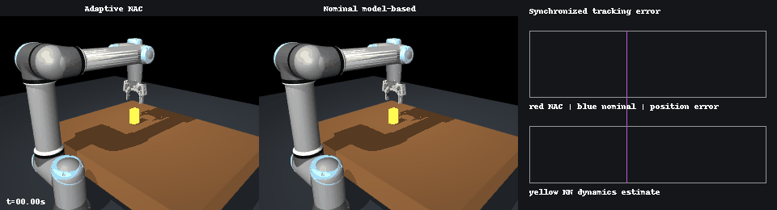
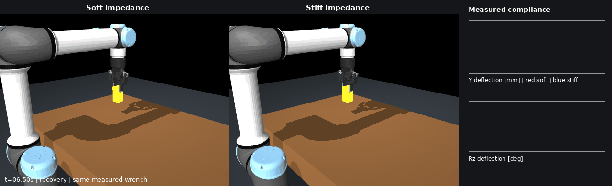
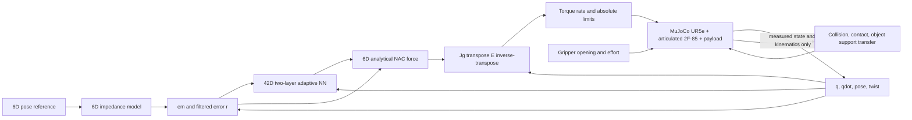

# ROS 2 Neuro-Adaptive Control

Six-DoF model-free neuro-adaptive impedance tracking through unknown payload
acquisition, demonstrated with full UR5e + Robotiq 2F-85 MuJoCo dynamics.

[](https://docs.ros.org/en/humble/)
[](https://releases.ubuntu.com/22.04/)
[](https://github.com/ZheminHuang/ros2_neuro_adaptive_control/actions/workflows/ci.yml)
[](LICENSE)
[](CHANGELOG.md)

## Key results

**Unknown 1 kg payload — adaptation handles an unmodeled dynamics change.**
After grasping an unannounced 1.00 kg payload, adaptive NAC achieved 0.230 mm
position RMSE and 0.236 mrad rotation-vector RMSE, versus 26.381 mm and
133.329 mrad for a fixed nominal model-based controller during loaded tracking.
The nominal controller received no payload mass, COM, or inertia and retained
its pre-pickup model.

<picture>
  <source srcset="docs/assets/payload_benchmark_comparison.webp" type="image/webp">
  
</picture>

**Impedance-parameter robustness — one NAC tuning across impedance settings.**
Without retuning the NAC gains, neural-network architecture, or adaptation
hyperparameters—and with online weight adaptation enabled—NAC tracked two
Cartesian impedance configurations under the same 6 N push and 1.0 N·m twist
and returned to the target after release. Across both tested settings,
maximum actual-to-impedance RMSE was 0.283 mm and 0.120 mrad.

<picture>
  <source srcset="docs/assets/compliance_comparison.webp" type="image/webp">
  
</picture>

**Hidden joint drag — adaptation handles an unmodeled plant change.** When
MuJoCo introduced an unannounced 8×/6× increase in selected joint damping and
friction, adaptive NAC achieved 0.271 mm position RMSE and 0.429 mrad
rotation-vector RMSE after the event, versus 4.121 mm and 41.529 mrad for the
fixed nominal model-based controller whose dynamics model was not updated.

<picture>
  <source srcset="docs/assets/joint_drag_comparison.webp" type="image/webp">
  
</picture>

## Quick Start

Requirements: Ubuntu 22.04, ROS 2 Humble, Python 3.10+, NumPy 1.24.4, and the
official MuJoCo 3.9.0 Python binding.

```bash
source /opt/ros/humble/setup.bash
python3 -m pip install --user "numpy==1.24.4" "mujoco==3.9.0"

cd your_ros2_workspace
rosdep install --from-paths src --ignore-src -r -y
colcon build --packages-select neuro_adaptive_control
source install/setup.bash

ros2 launch neuro_adaptive_control payload_benchmark.launch.py
```

The launch opens the native MuJoCo viewer and runs the adaptive controller at
a fixed 500 Hz simulation target. For headless, faster-than-real-time execution:

```bash
ros2 launch neuro_adaptive_control payload_benchmark.launch.py \
  viewer:=false realtime:=false
```

Select a comparison controller with
`controller:=frozen_at_payload`, `controller:=nominal_model_based`, or
`controller:=oracle_model_based`. Reproduce every held-out trial and all
committed evidence artifacts with:

```bash
MUJOCO_GL=egl python3 examples/run_payload_benchmark.py
MUJOCO_GL=egl python3 examples/run_showcase_benchmarks.py
```

## Architecture



The running torque path is the power-consistent 6D NAC mapping only; bounded
joint damping is reserved for stopping or fault handling. The earlier 3D RBF
API and demos remain available for compatibility.

Apache-2.0 project code; vendored robot assets retain their documented BSD
licenses. See [LICENSE](LICENSE), [CITATION.cff](CITATION.cff),
[CONTRIBUTING.md](CONTRIBUTING.md), and [THIRD_PARTY_NOTICES.md](THIRD_PARTY_NOTICES.md).
