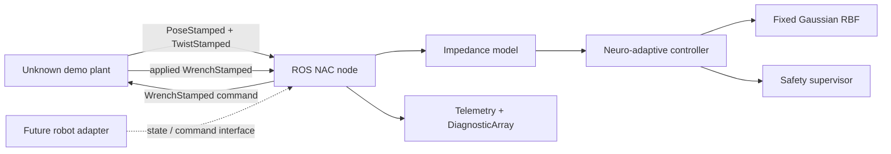

# Architecture

The controller core has no ROS imports. ROS nodes translate standard messages
to and from the core; future hardware adapters implement state estimation and
command mapping outside the algorithm package.

## Deterministic ROS handshake

The plant publishes pose, twist, and applied external wrench with the same
frame and exact simulation stamp. The controller computes once only after all
three messages for that stamp are present and echoes the stamp on its command.
The plant advances exactly one fixed step only when the command stamp matches
its pending state. A missing command delays wall-clock progress; it never
changes the numerical step or reuses an old command.

Algorithmic state uses the fixed stamp interval. A separate monotonic clock
drives watchdogs and reports observed wall-clock throughput.

## Future adapter boundary

`adapters/interfaces.py` defines a Cartesian state provider and force-command
sink. A hardware implementation must add, validate, and test:

- joint/state estimation, forward kinematics, Jacobian, and singularity policy;
- complete frame and sign conventions for measured external force;
- command mapping, controller-manager integration, rate limits, and stops;
- robot-specific workspace, collision, velocity, force, and recovery guards.

No such implementation is included or implied by v0.1.0.
